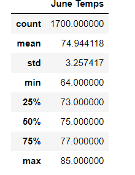
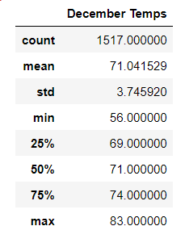

# surfs_up

## Overview of Analysis
An investor is interested in opening a surf shop in Oahu. Before committing financially, said investor would like to review temperature data pertaining to the months of June and December in order to determine if the shop will be sustainable year round. Using SQLAlchemy, we wrote a series of queries to access the relevant data from a SQLite database. We then converted these data into dataframes using Pandas. Finally, we used the describe() method to retrieve summary statistics for each month.

## Results of Analysis

### June Results
  
### December Results  
  
### Key Differences  
- June has a slightly higher mean temperature (74 degrees fahrenheit) than December (71 degrees fahrenheit).  
- June's highest and lowest recorded temperatures are also higher than December's.  
- June has more total observed temperature than December.  

## Summary  
While temperatures are slightly cooler in December than in June, the differences are nearly imperceptible. Therefore, seasonal temperature changes alone should not be enough to impact the year-long sustainability of the proposed surf shop.
